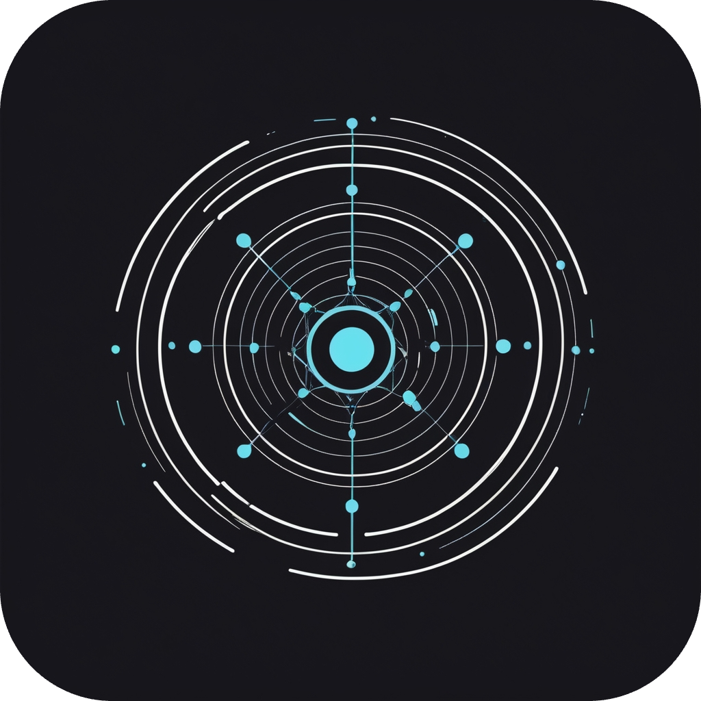

   

        
    

    
 
        
        &nbsp;&nbsp;&nbsp;&nbsp;&nbsp;&nbsp;
        
        &nbsp;&nbsp;&nbsp;&nbsp;&nbsp;&nbsp;
        
    

     
    

        
    

    

    <h3 align="center">
        <b>Comp Sci Undergrad &nbsp;&bull;&nbsp; ML Researcher &nbsp;&bull;&nbsp; Indie App Dev &nbsp;&bull;&nbsp; Open-source Contributor</b>
    </h3>
    

    <table>
        <tr>
            <td width="150">
                
            </td>
            <td>
                <h3><a href="https://github.com/surtecha/karman" target="_blank">karman</a></h3>
                
<strong>karman</strong> is a minimalist and intuitive productivity app designed to help you manage tasks, track habits, and stay focused. Completely free and open-source, karman is perfect for individuals who value simplicity and efficiency. Available on <strong>Google Play Store</strong>

            </td>
        </tr>
        <tr>
            <td width="150">
                
            </td>
            <td>
                <h3><a href="https://github.com/surtecha/multi-physics-simulation-engine" target="_blank">Multi-Physics Simulation Engine</a></h3>
                
A comprehensive physics simulation engine written entirely in Python, designed to simulate a wide range of physical phenomena, including fluids, molecular dynamics, and gravitation. It comes with an intuitive user interface, making it accessible and easy to use for both beginners and advanced users.

            </td>
        </tr>
        <tr>
            <td width="150">
                
            </td>
            <td>
                <h3><a href="https://github.com/surtecha/SignLangNET" target="_blank">SignLangNET</a></h3>
                
SignLangNET is a project aimed at interpreting sign language gestures using deep learning techniques. It utilizes the MediaPipe library for hand and body pose estimation and employs Long Short-Term Memory (LSTM) networks for sequence modeling, with a <strong>96.4%</strong> gesture translation accuracy.

            </td>
        </tr>
    </table>
     

